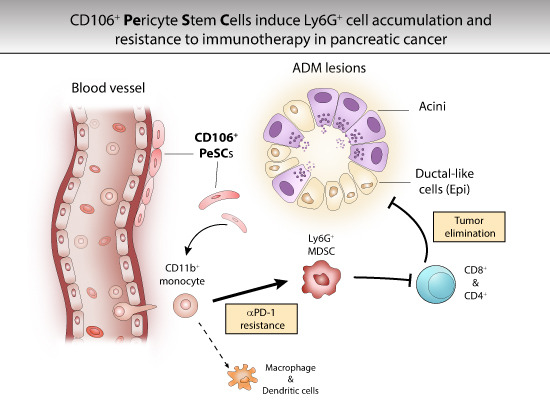

# PeSCs

# 

## Pericyte stem cells in pancreatic cancer

Code required to reproduce the single cell RNAseq analyses published in Wu et al. EMBO Rep 2023, *"Pericyte stem cells induce Ly6G+ cell accumulation and immunotherapy resistance in pancreatic cancer"*, by Zhichong Wu, Kevin Thierry, Sophie Bachy, Xinyi Zhang, Pia Gamradt, Hector Hernandez-Vargas, Ivan Mikaelian, Laurie Tonon, Roxanne Pommier, Yajie Zhao, Philippe Bertolino, and Ana Hennino.

Link to manuscript: https://www.embopress.org/doi/full/10.15252/embr.202256524

---
